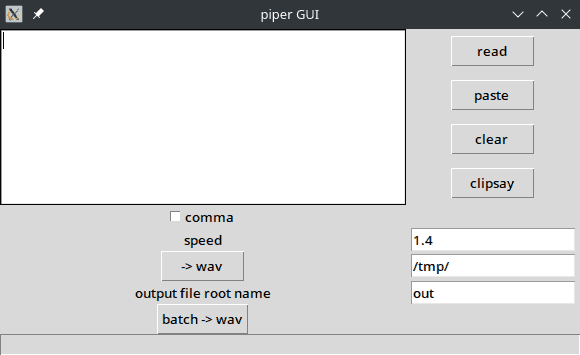

# piper_gui
a minimalist GUI for [piper](https://github.com/rhasspy/piper), on linux.



This is a simple script I created for my own usage:
* to read aloud text from the clipboard.
* to read aloud text typed in a text widget.
* to batch process text from a file into sound files that can be imported into anki.

# Usage
* read : read the text in the text widget on the left.
* paste : paste clipboard into this widget.
* clear : clear this widget.
* clipsay : read aloud the clipboard.
* comma : will add a pause between words (by replacing spaces by commas).
* speed : (float) 1 is "normal" reading speed. Less is faster, more is slower.
* ->wav : generate one wav file from the text in the text widget.
* root name : out will output out.wav if you clic ->wav; out1.wav out2.wav... in batch mode. It needs to be unique for each batch for anki.
* /tmp/ (output directory) replace this directory by where you want your files to be created. (I use zram from zram-tools on my pi)
* batch : select a text.txt file (utf8) with one phrase (or word) per line. Each line will generate one wave file.

# installation
* get linux and python (min. 3.10) (until now, I thought that piper was linux only, so I wrote with linux support only in mind. You can make a pull request for windows if you want, or buy me an hardware upgrade for windows 10 to 11 and I will add support ;-) ).
* install [piper](https://github.com/rhasspy/piper) with piper in path.
   * Personally, I used [pipx](https://pipx.pypa.io/latest/) for that. First install it then run `pip install piper-tts`. It will install it in a venv which is cleaner, and mandatory if pip is managed.
   * download voices for piper. You can run piper example command for that in a directory where you have write access. Change `en_US-lessac-medium` by the voice you want [see list here](https://huggingface.co/rhasspy/piper-voices/tree/v1.0.0)
```
echo 'Welcome to the world of speech synthesis!' | piper \
  --model en_US-lessac-medium \
  --output_file welcome.wav
```
   * this will download two files. I recommand that you move them somewhere like `/home/your_user_name/.local/pipx/venvs/piper-tts/lang/`
* option 1 using a venv
  * create a venv and download the files from this repo inside the venv. I didn't do it from command line, but I think it's something like
     * (from a directory in your home where you install scripts) `python -m venv piper_gui`
     * `cd piper_gui`
     * `source ./bin/activate`
     * normaly `pip list` should list only itself.
     * `pip install -r requirements.txt`
     * modify piper_gui_config.toml : remplace `/home/your_user_name/.local/pipx/venvs/piper-tts/lang/ru_RU-irina-medium.onnx` by the voice you downloaded.
     * `python piper_gui_pygubu.py` to run the GUI.
     * `sudo chmod +x piper_gui.sh` if you want a one-clic bash file to run the gui next time.
* option 2 as a python module
  * dowload a release
  * It's a python module with all dependencies inside, it won't pollute your system.
  *  uncompress this archive somewhere in user land in a directory named piper_gui
  *  modify piper_gui_config.toml as above
  *  cd to parent directory (cd ..)
  *  run this module with "python piper_gui/ "

# Anki
* this script will also generate a semicolon delimited csv file that you can edit to import into anki.
* column A : line of text to read
* column B : name of sound file
* column C : keep only this colomn for anki (text+name of sound that anki will play)
So, for anki, delete column A and B, keep C, write translation in new column B.
Then convert all wav files to opus (using [fre:ac](https://www.freac.org/) for example, snap install freac), and move the opus files into anki media folder (something like `/home/your_user_name/.local/share/Anki2/User 1/collection.media/`). Each name must be unique, so change the root name each time.
* if it seems overly complicated, you can use the awesome AwesomeTTS anki plugin.

# Todo and limitations
* interaction with piper is dubiously written as I just translated into python their exemple in bash with pipes. (with safeties, but don't try to inject bash commands into the GUI anyway)
* The GUI will freeze during batch and no parallelism is used (because multiprocessing crashes tkinter and I got bored of this)
* If someone asks, I may add an option to change the voice from the gui and not the toml file.
